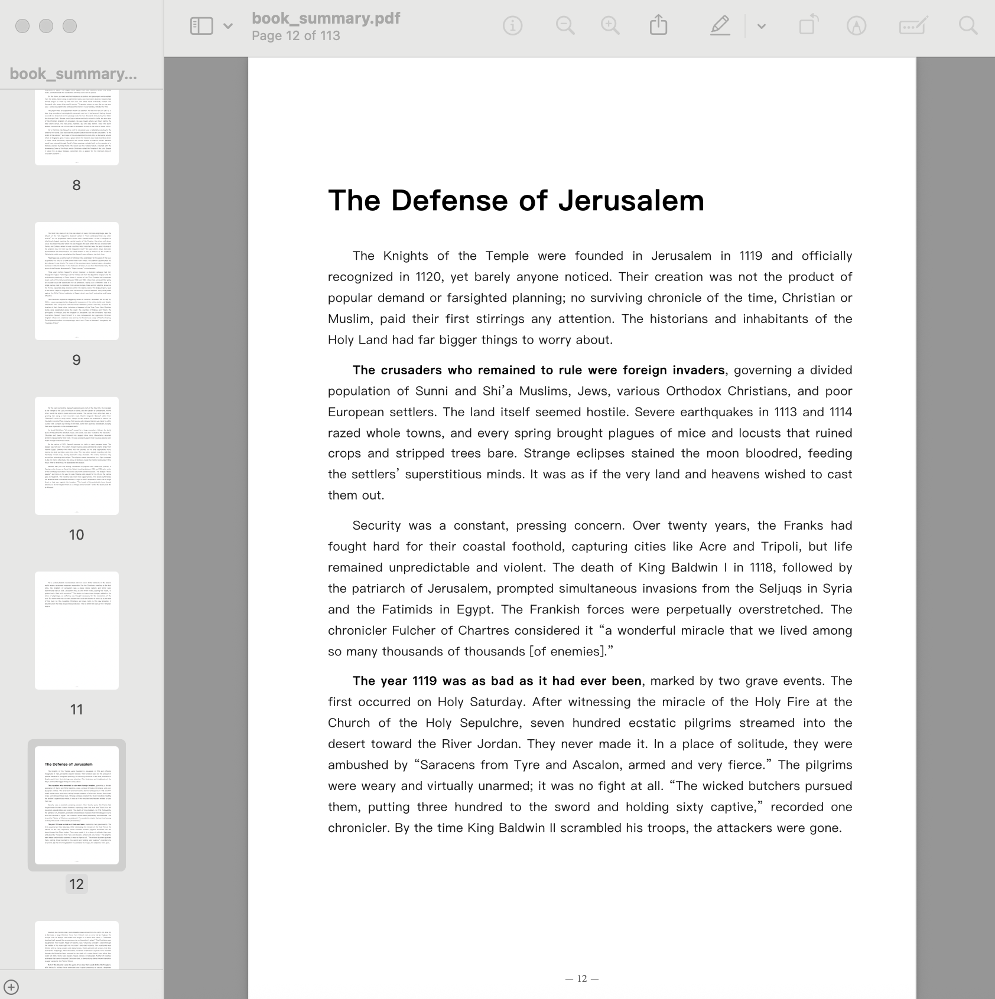
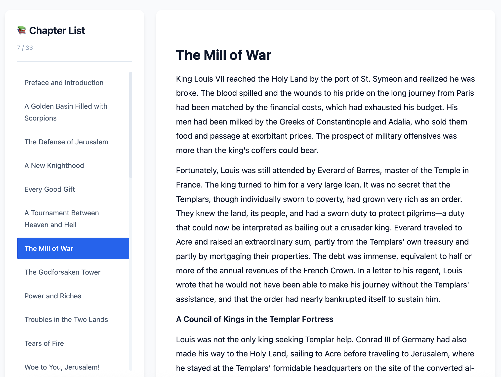
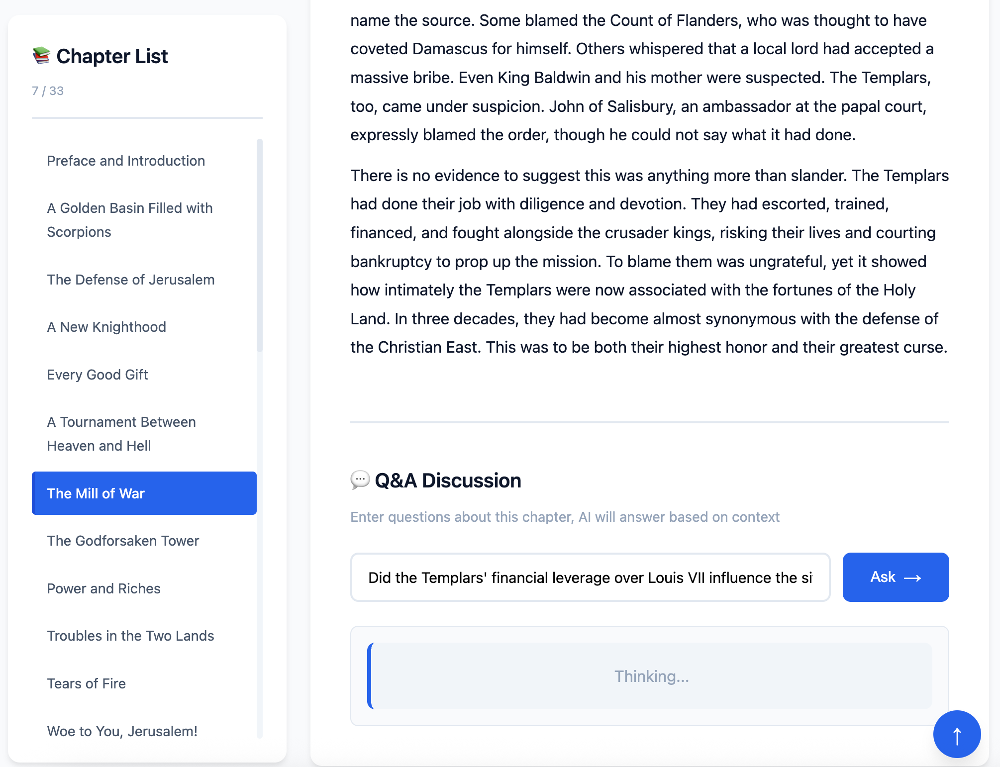
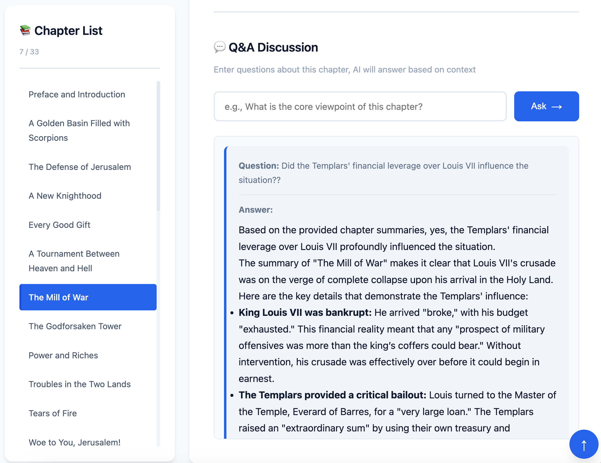
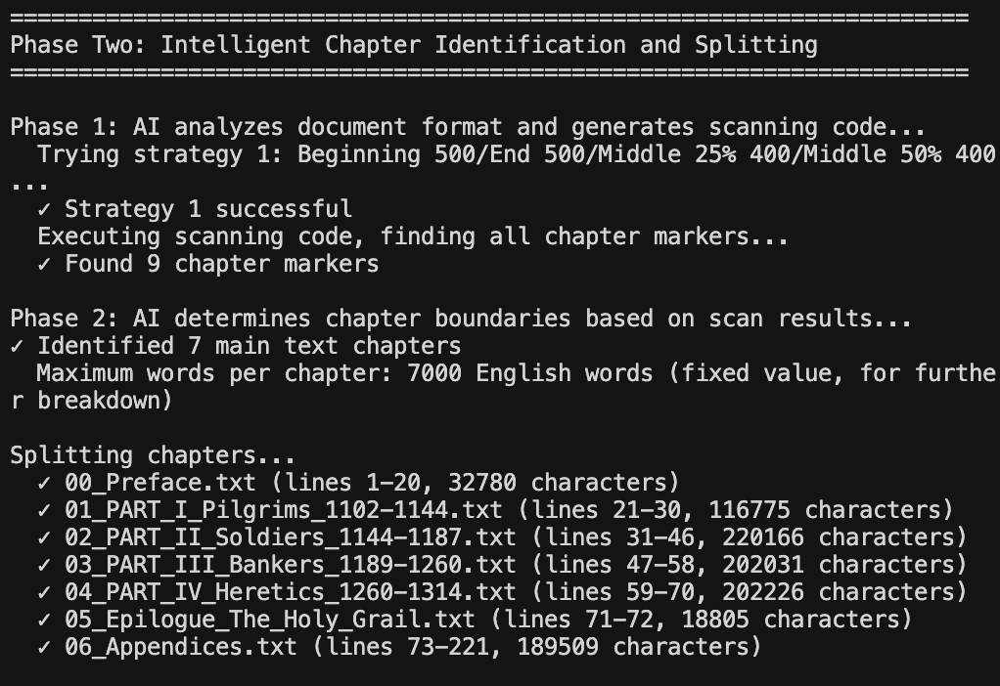
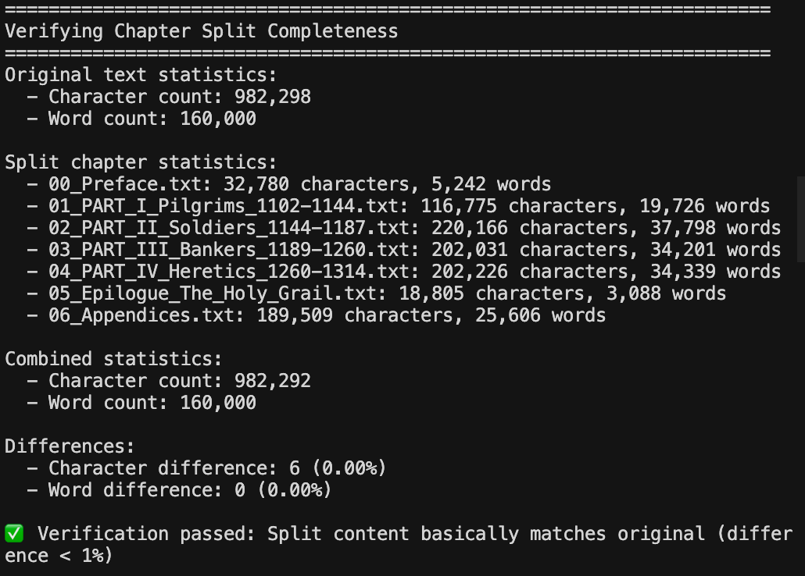
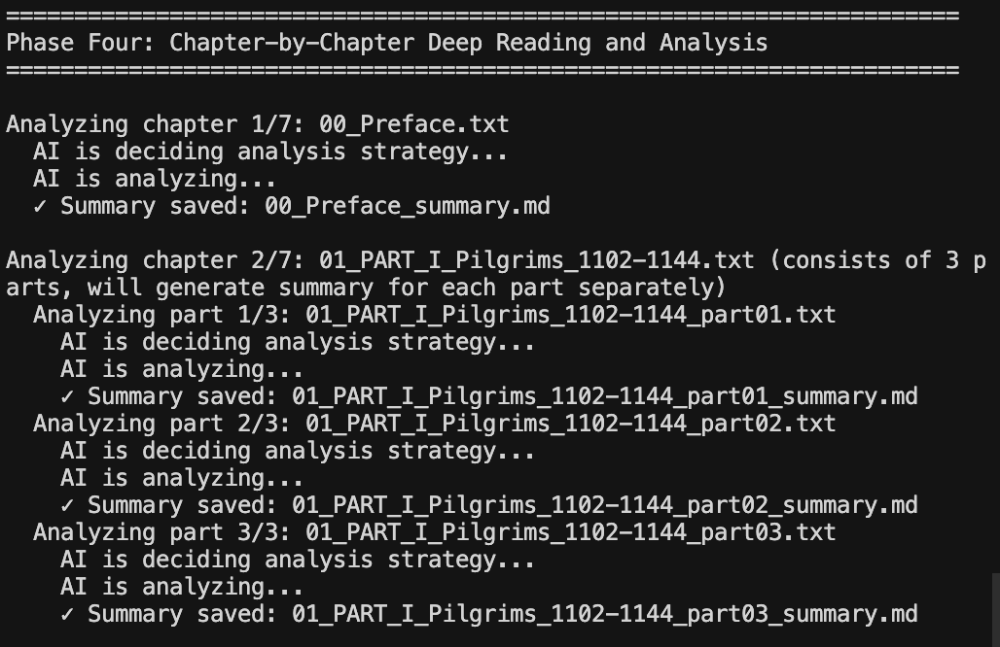

# Vibe Reading Skill


> **Vibe Reading — The skill you truly need to master in the AI era.**

**An intelligent reading analysis Agent Skill that helps users quickly understand the core content of voluminous works.**

---

## 📖 Vision: Regaining Depth in the Age of Noise

> **"Read old books well, and wisdom will emerge."**
>
> — *Tui Bei Tu* (Ancient Chinese Prophecy)

<br/>

> **"In the age of AI, output is cheap, but input is the real luxury."**

In this era of AIGC explosion, the cost of generating information has approached zero. We are surrounded by massive amounts of algorithmically generated "fast-food content," while beyond this digital noise, those **Pre-AIGC era** classics—those crystallizations of genuine human wisdom and logic—have become difficult to access due to the "information overload" we face.

**Vibe Reading Skill** was born to solve this era's cognitive dilemma: **How do we use limited time to absorb unlimited wisdom?**

Our goal is not to replace reading, but to **make books thinner**.

### Core Philosophy

* **🛡️ Zero Hallucination (via Smart Chunking)**
    AI is often criticized for "hallucinations," which is unacceptable in knowledge acquisition. This Skill adopts rigorous **Smart Chunking** technology, forcing AI to analyze only based on the original text of the current slice. It's like putting "shackles" on AI, making it no longer a freewheeling "creator" but a down-to-earth "analyst."

* **💎 Mining Pre-AIGC Wisdom**
    True insights are often hidden in voluminous works. Through AI's deep structured analysis, we help you filter out padding and redundancy, directly extracting the skeleton and core logic of the author's thoughts, allowing the "wisdom" in "old books" to see the light of day again.

* **🗣️ From "One-Way Reading" to "Two-Way Dialogue"**
    Reading should not be a lonely journey. Through the generated **interactive HTML**, you can ask AI questions about any unclear points in the book at any time. When reading encounters obstacles, it is the knowledgeable and patient reading guide by your side.

---

## ✨ Features

- 📚 **Intelligent Chapter Identification**: AI automatically identifies book structure, no manual configuration needed
- 🔄 **Contextual Coherence**: Each chapter analysis references previous chapter summaries, maintaining coherent understanding
- 📄 **Multiple Output Formats**: Markdown, PDF (auto-generated cover), HTML interactive interface
- 🌍 **Multi-language Support**: Automatically identifies and adapts to books in different languages
- 🤖 **AI-Driven**: Completely AI-driven decisions, adapting to books in any format
- 🛡️ **Smart Retry Mechanism**: Automatically handles API quota limits, retries on errors (up to 5 times)
- 📖 **Auto Cover Generation**: Automatically extracts book title and author from filename, generates professional PDF cover

---

## 📸 Feature Showcase

### 📄 PDF Summary - Making Books Thinner

Generate professional summary analysis with one click, as shown:

<div align="center">
  
  <p><em>I'm currently reading a biography of Augustus, the original book is a voluminous masterpiece with over 600 pages</em></p>
  
  
  <p><em>After structured analysis, the essence is condensed to 77 pages</em></p>
</div>

### 🌐 HTML Interactive Reading Interface

Through the interactive HTML interface, you can:
- 📖 Browse chapter list, quickly locate content
- 💬 Have Q&A conversations with AI, deeply understand viewpoints in the book
- 🔍 Get precise answers based on context

<div align="center">
  
  <p><em>Interactive reading main interface</em></p>
  
  
  <p><em>Chapter reading and navigation</em></p>
  
  
  <p><em>AI Q&A conversation feature</em></p>
</div>

### 🤖 Agent Skill Runtime

Intelligent processing flow, from chapter identification to deep analysis:

<div align="center">
  
  <p><em>Intelligent chapter identification and splitting</em></p>
  
  
  <p><em>Chapter splitting completeness verification</em></p>
  
  
  <p><em>Chapter-by-chapter deep reading and analysis</em></p>
</div>

---

## Quick Start

### Prerequisites

- Python 3.8+
- Google Gemini API Key

### Installation

#### Method 1: Install as Python Package (Recommended)

```bash
# Install from GitHub
pip install git+https://github.com/drbillwang/vibe-reading-skill.git

# Or install from local (development mode)
git clone https://github.com/drbillwang/vibe-reading-skill.git
cd vibe-reading-skill
pip install -e .
```

#### ⚠️ Important: Install PDF Generation Dependencies

**PDF generation requires Playwright and browser support.** If not installed, PDF generation will be skipped, but other features (Markdown, HTML) will work normally.

Installation steps:

```bash
# 1. Install playwright (if installing this package via pip install, playwright should already be included in dependencies)
pip install playwright

# 2. Install Chromium browser (this step is important!)
playwright install chromium
```

**Note**:
- If you only run `pip install playwright` but don't run `playwright install chromium`, PDF generation will fail
- Installing the browser takes some time (approximately 100-200MB download)
- If you don't need PDF functionality, you can skip this step, Markdown and HTML output are not affected

### Configuration

Create a `.env` file:

```bash
GEMINI_API_KEY=your_api_key_here

# Optional: Specify the model to use (default: gemini-2.5-pro)
# Recommended models:
#   gemini-2.5-pro      - Gemini 2.5 flagship model (stable and reliable) ⭐ Default recommended
#   gemini-3-pro        - Gemini 3 flagship model (latest, strongest performance)
#   gemini-3            - Gemini 3 standard model
#   gemini-2.5-flash    - Gemini 2.5 fast model (fast speed, low cost)
#   gemini-1.5-pro      - Stable version (verified)
GEMINI_MODEL=gemini-2.5-pro

# Optional: Proxy configuration (if encountering "User location is not supported" error)
# HTTP_PROXY=http://your_proxy_host:port
# HTTPS_PROXY=http://your_proxy_host:port
```

**Model Selection**:
- `gemini-2.5-pro` (default): Stable and reliable, suitable for high-quality analysis
- `gemini-2.5-flash`: Fast speed, low cost, suitable for quick processing or limited quota situations
- `gemini-1.5-pro`: Stable version, verified

**Tips**:
- If encountering API quota limits (429 error), you can:
  1. Switch to `gemini-2.5-flash` model (more lenient quota limits)
  2. Wait a while and retry (system will automatically retry, up to 5 times, wait times: 90/120/150/180/210 seconds)
- If encountering "User location is not supported" error, you need to configure proxy (see proxy configuration above)

### Usage

#### Basic Usage: Process Entire Book

```python
from vibe_reading_skill import process_book

result = process_book("your_book.epub")
print(result["status"])  # 'success' or 'error'
```

#### Advanced Usage: Generate PDF from summaries Directory

If you already have a summaries directory, you can directly generate PDF:

```python
from vibe_reading_skill import generate_pdf_from_summaries
from pathlib import Path

# Generate PDF from summaries directory (auto-extract book title and author)
generate_pdf_from_summaries(
    summaries_dir=Path("./summaries"),
    output_path=Path("./book_summary.pdf"),
    book_title="Book Title",  # Optional, if not provided will auto-extract from filename
    book_subtitle="Subtitle (optional)",
    book_author="Author Name (optional)",  # Optional, if not provided will auto-extract from filename
    skip_files=['Front_Matter', 'Authors_Note'],  # Optional: skip certain files
    auto_extract_title=True,  # Default True, auto-extract book title and author from filename
    include_all_md=False  # Default False, only process *_summary.md files
)
```

**Cover Generation**:
- If `00_Cover.md` or `00_Cover` file exists in the `summaries/` directory, it will be used as the cover
- If no cover file exists, it will automatically extract book title and author from the input filename and generate a cover
- The cover will be automatically included in the generated PDF

## Workflow

1. **Document Preprocessing**: EPUB → TXT conversion (if needed)
2. **Intelligent Chapter Identification**: AI automatically identifies chapter structure (supports progressive preview strategy for large documents)
3. **Further Breakdown**: AI evaluates chapter length and splits if necessary
4. **Chapter-by-Chapter Analysis**: AI deeply reads each chapter and generates summaries (with smart retry mechanism)
5. **Format Output**: Generate Markdown, PDF (auto-generated cover), HTML

### Smart Retry Mechanism

When encountering API quota limits (429 error), the system will:
- Automatically detect error type
- Try to extract suggested wait time from error message
- If no suggested time, use predefined delay sequence: 90 → 120 → 150 → 180 → 210 seconds
- Retry up to 5 times for each error
- Each API call has independent retry opportunities

### Auto Cover Generation

PDF generation will automatically:
- Extract book title and author from input filename (supports `Book Title -- Author` or `Book Title - Author` format)
- If no cover file exists, automatically generate professional cover
- If `00_Cover.md` or `00_Cover` file exists, prioritize using it

## Output Directories

After processing completes, the following output directories will be created in the current directory:

- `chapters/` - Split chapter original text
- `summaries/` - Chapter summaries (Markdown)
- `pdf/` - PDF output (requires Playwright and Chromium installation, see installation instructions above)
- `html/` - HTML interactive interface

## Design Philosophy

This Skill adopts an **AI-driven, not code-driven** design philosophy:

- ✅ **AI Makes All Decisions**: Chapter identification, splitting strategy, analysis focus, etc., are all judged by AI based on specific situations
- ✅ **Code Only Executes**: Code only executes AI's decisions (file I/O, format conversion, etc.)
- ✅ **Smart Error Handling**: If AI-generated code execution fails, AI will see the error and regenerate until successful
- ✅ **Progressive Preview**: When processing large documents, gradually reduce preview content to avoid exceeding token limits
- ❌ **Avoid Hard-coded Rules**: No preset "if X then Y" rules

This allows the Skill to handle books in any format and any language without writing code for each new format.

### Error Handling Strategy

1. **Chapter Identification Code Execution Failure**: AI will see error information, analyze the problem and regenerate code, retry up to 3 times
2. **API Quota Limits**: Automatic retry, wait time gradually increases (90/120/150/180/210 seconds), up to 5 times
3. **Large Document Processing**: Use progressive preview strategy, gradually reduce content sent to AI until successful

## Contributing

Contributions are welcome! Please submit Issues or Pull Requests.

## License

Apache 2.0 License - See [LICENSE](LICENSE) for details

## Using as a Skill

This project is configured as a standard Python Skill and can:

- ✅ Be installed via `pip install`
- ✅ Be called directly in IDE

### Skill Call Example

```python
from vibe_reading_skill import process_book

# Basic call
result = process_book("book.epub")

# View results
if result["status"] == "success":
    print(f"Processing complete! Chapter count: {result['metadata']['chapter_count']}")
    print(f"PDF: {result['output_paths']['pdf']}")
    print(f"HTML: {result['output_paths']['html']}")
else:
    print(f"Error: {result['message']}")
```

### Return Value Format

```python
{
    "status": "success",  # or "error"
    "message": "Book processing complete",
    "output_paths": {
        "chapters": "chapters/",
        "summaries": "summaries/",
        "pdf": "pdf/book_summary.pdf",
        "html": "html/interactive_reader.html"
    },
    "metadata": {
        "book_title": "Book Title",
        "chapter_count": 10,
        "processing_time": 123.45
    }
}
```

## FAQ

### Q: What to do when encountering "User location is not supported" error?

A: You need to configure proxy in the `.env` file:
```bash
HTTP_PROXY=http://your_proxy_host:port
HTTPS_PROXY=http://your_proxy_host:port
```

### Q: PDF generation failed, prompting "playwright not installed"?

A: You need to complete two-step installation:
1. `pip install playwright`
2. `playwright install chromium` ← This step is important!

### Q: Encountering API quota limits (429 error)?

A: The system will automatically retry (up to 5 times), or you can:
1. Switch to `gemini-2.5-flash` model (more lenient quota limits)
2. Wait a while and rerun

### Q: How to customize PDF cover?

A: Create a `00_Cover.md` file in the `summaries/` directory, first line is the book title, subsequent lines are other information (author, date, etc.)

## Related Links

- [Skill Instructions](SKILL.md) - AI processing instructions
- [Environment Variable Example](env.example) - Complete configuration example
